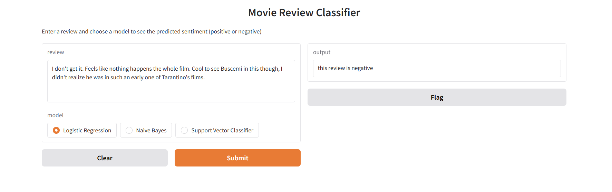

# movie-review-sentiment-classification

This project focuses on training and evaluating machine learning models - **Logistic Regression, Naive Bayes, and Support Vector Classifier (SVC)** - to classify movie reviews as positive or negative.
The notebook walks through the full pipeline of a sentiment analysis task, including:

- Loading and exploring the dataset 
- Text (review) preprocessing: cleaning, tokenization, stopword removal, lemmatization and etc.
- Feature extraction using TF-IDF vectorization
- Model training and evaluation using scikit-learn
- Performance comparison using accuracy, precision, recall, F1-score, and confusion matrix

The project also includes a section for fetching real-world reviews for movies using **TMDB** API and predicts their sentiment using trained models. Finally a simple **Gradio** interface (where a review can be pasted or typed) was implemented to allow easier real-time sentiment prediction.

 ## Preview
 
